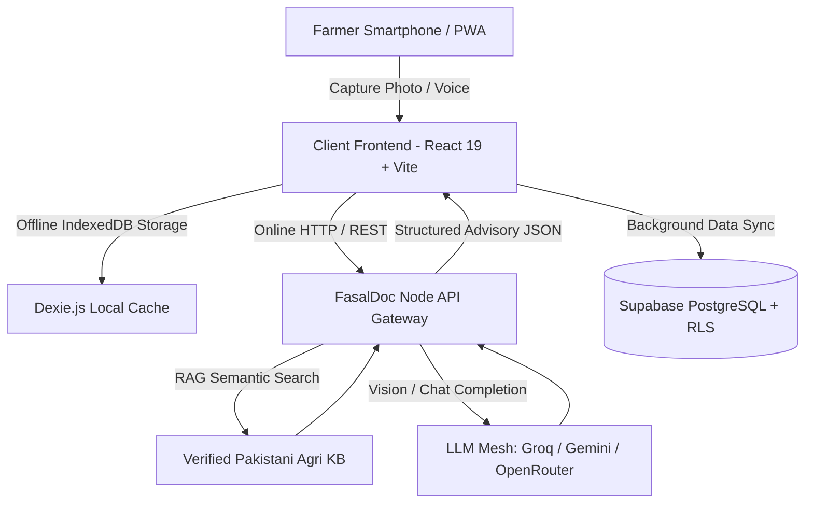

# 🌱 FasalDoc — AI-Powered Crop & Livestock Health Intelligence

> **Empowering 8M+ Smallholder Farmers Across Pakistan with Edge Computer Vision, Multi-Modal RAG Knowledge Systems, and Offline-First Agricultural Healthcare.**

[](https://react.dev/)
[](https://vitejs.dev/)
[](https://nodejs.org/)
[](https://supabase.com/)
[](https://groq.com/)
[](LICENSE)
[](https://github.com/ZunainTahir/fasalDoc/actions/workflows/frontend-ci.yml)
[](https://web.dev/progressive-web-apps/)
[](src/test/)

---

## 📌 Executive Summary

**FasalDoc** is an AgriTech startup platform built to bridge the critical veterinary and agricultural extension gap in South Asia. Smallholder farmers face up to **35-40% annual crop loss and severe livestock mortality** due to delayed diagnosis, remote farmland locations, and lack of affordable agronomic expertise.

FasalDoc provides an **instant, bilingual (Urdu & English), multi-modal AI companion** that runs right from the farmer's smartphone camera — diagnosing plant pathologies and animal diseases in real-time, delivering certified chemical + organic remedies with exact dosages and local Pakistani brand recommendations, fully operable **online or completely offline**.

---

## 🚀 Key Value Propositions & Features

### 📸 1. Multi-Modal Vision Diagnosis (Crop & Livestock)
- **Computer Vision Pipeline**: Real-time image capture with client-side canvas compression (max 1024px, JPEG q0.7) for low-bandwidth 2G/3G mobile networks.
- **Dual Diagnosis Engine**: Accurately classifies conditions across staple crops (*Wheat, Rice, Cotton, Tomato, Potato, Maize, Sugarcane*) and dairy livestock (*Cattle, Buffalo, Goat, Sheep*).
- **Verified Remedy Prescriptions**: Every diagnosis matches verified treatments detailing:
  - 🌿 **Organic / Traditional Home Remedies** (Sour buttermilk whey, neem extract, wood ash).
  - 🧪 **Chemical Treatment & Active Ingredients** with local Pakistani brand names (Syngenta, Bayer, FMC, Engro, ICI).
  - 💊 **Dosage per Acre / Kanal / Animal Weight**.
  - 🛡️ **Preventative agronomic measures**.

### 💬 2. Agricultural Voice & AI RAG Assistant
- **Bilingual Conversational Interface**: Native support for Nastaliq/Urdu (`ur-PK`) and English (`en-US`).
- **Voice-Enabled Speech Recognition**: Direct voice inquiry for low-literacy farmers.
- **Instant Domain RAG (Retrieval-Augmented Generation)**: Grounded agricultural knowledge base combining localized agronomic rules with LLM synthesis (Gemini 2.0, Groq Llama-3.3-70B, OpenRouter).
- **Sub-50ms Offline Fallback**: Generates instant structured remedy advice even with zero internet connectivity.

### 📶 3. Resilient Offline-First Architecture
- **Local Database (IndexedDB via Dexie.js)**: Scans, history, offline remedy catalogues, and chat sessions are stored locally on device.
- **Background Cloud Sync**: Automatically enqueues mutations and synchronizes with **Supabase PostgreSQL** via bidirectional reconciliation when connectivity is restored.
- **1-Tap Guest / Demo Mode**: Pre-seeded demo account for zero-friction evaluations, field tests, and judge demonstrations.

### 🛠️ 4. Farmer Utility Hub — 14 Tools (`/tools`)
- **Disease & Pathology Library**: Searchable database of 20+ localized crop pests and animal health conditions with verified remedies.
- **Location-Aware Weather & Disease Risk**: Auto-detect or manually select any city across all Pakistani provinces; real OpenWeatherMap integration with realistic fallback data; 5-day disease risk scoring.
- **Live Mandi Rates**: Daily commodity prices from major markets in **Punjab, Sindh, KPK, Balochistan, Gilgit-Baltistan, and AJK** with trend indicators.
- **Government Schemes Directory**: Bilingual guide to federal + provincial schemes (PM Kisan Card, crop insurance, livestock subsidies, seed/fertilizer support, solar tube-wells, etc.) filtered by province.
- **Tele-Vet & Crop Advisor Booking**: Book video/audio or field visits with registered veterinarians, crop specialists, and extension officers.
- **Fertilizer & NPK Dosage Calculator**: Custom per-acre/kanal calculation for DAP, Urea, SOP Potash, and Zinc.
- **Crop Calendar**: Sowing, irrigation, fertiliser, pest watch, and harvest windows for major crops by province.
- **Soil Health Score**: pH, texture, organic matter, and salinity based soil score with amendment recommendations.
- **Irrigation Planner**: Crop, growth stage, soil type, and temperature based water requirement & scheduling advice.
- **Yield & Income Estimator**: Low/average/high harvest and revenue projections for 7 major crops, with acre or kanal input.
- **Seed Rate Calculator**: Exact seed quantity per acre with spacing and season guidance for major crops.
- **Community Pest & Disease Reports**: Hyperlocal outbreak alerts and advisories reported by farmers, filtered by province.
- **Emergency Helpline Directory**: 1-tap direct phone dialing for local veterinary clinics and agricultural extensions.
- **Interactive Pitch Deck**: Built-in executive slideshow for pitch competitions and investor demos.
- **Push Notification Ready**: Web Push subscription helpers for weather alerts and advisory reminders.

### 🧪 5. Production-Ready Engineering
- **Error Boundaries**: App-level crash recovery with friendly reload UI.
- **Skeleton Loaders**: Shimmer placeholders for async data to improve perceived performance.
- **Dark Mode**: Full day/night theme across every screen with persistent preference and system-color fallback.
- **Automated Testing**: 48 Vitest unit tests covering weather, market, schemes, yield, seed rate, and community report logic.
- **GitHub Actions CI**: Type-check, test, and PWA build on every push/PR.

---

## 🏗️ System Architecture



---

## 💻 Tech Stack

| Layer | Technologies | Purpose |
|---|---|---|
| **Frontend App** | React 19, TypeScript, Vite, TailwindCSS | High-performance mobile-first PWA with Urdu RTL/LTR layout |
| **Local Storage & Offline** | Dexie.js (IndexedDB), Service Workers, Workbox | 100% offline data durability and auto-sync queue |
| **Backend API** | Node.js, Express.js (ESM), REST | High-throughput AI proxy, rate-limiting, and RAG orchestrator |
| **AI / ML & Vision** | Gemini 2.0 Flash, Groq Llama-3.3-70B, Vision Models | Sub-second visual pathology diagnosis and natural language reasoning |
| **Knowledge Engine** | Custom Agricultural RAG Engine | Localized chemical/organic treatments for Pakistani farming ecosystems |
| **Database & Auth** | Supabase (PostgreSQL, Row Level Security, Auth) | Secure user accounts, history tracking, and farm profile management |

---

## 📁 Project Structure

```
FasalDoc_Complete/build/
├── src/                         # React 19 PWA Frontend
│   ├── components/              # Offline banners, UI controls, headers
│   ├── context/                 # AuthContext (Demo/Supabase) & LanguageContext (Urdu/English)
│   ├── lib/                     # API client, Dexie DB, RAG engine, remedy database, yield/seed/community modules
│   ├── test/                    # Vitest unit tests (48 passing)
│   └── screens/                 # HomeScreen, CaptureScreen, AssistantScreen, ToolsScreen, AuthScreen
├── backend/                     # Node.js + Express AI Gateway
│   ├── src/
│   │   ├── server.js            # Express API server & routes (/api/diagnose, /api/chat)
│   │   ├── llm.js               # Multi-provider client (Gemini, Groq, OpenRouter)
│   │   ├── rag.js               # Domain RAG retrieval & knowledge engine
│   │   ├── diagnose.js          # Vision diagnosis processor & schema validation
│   │   └── remedyKeys.js        # Crop & livestock catalogue mapping
│   ├── package.json
│   └── .env.example
├── supabase/
│   └── schema.sql               # PostgreSQL tables, indexes & RLS policies
├── docs/                        # Project report & investor pitch deck
├── Startup/                     # Business Plans, Pitch Decks & Partnership Docs
└── vite.config.ts               # Vite PWA and build configuration
```

---

## ⚡ Quick Start Guide

### Prerequisites
- Node.js `>= 18.0.0`
- npm or pnpm

### 1. Clone & Setup Backend

```bash
cd backend
npm install
cp .env.example .env
```

*(Optional)* Add your free API keys to `backend/.env`:
```env
PORT=8000
GROQ_API_KEY=gsk_your_groq_api_key_here
GEMINI_API_KEY=AIzaSy_your_gemini_key_here
```

Start the backend:
```bash
npm start
# 🚀 Backend listening on http://localhost:8000
```

### 2. Setup & Run Frontend

In the root directory:
```bash
npm install
npm run dev
# 🌐 Live App accessible at http://localhost:5173
```

> **💡 Fast Demo Tip**: On the login screen, click **"Continue as Demo Farmer (چوہدری طارق)"** to explore all AI diagnosis, RAG chatbot, and tools features instantly with pre-seeded data.

---

## 🔒 Security & Data Privacy

- **Zero Client-Side API Keys**: All LLM and AI keys are securely held on the Node.js backend.
- **Row-Level Security (RLS)**: User scans, diagnoses, and personal farm data in Supabase are isolated strictly per authenticated user ID.
- **Client-Side Compression**: Photos are downscaled before transmission to protect bandwidth and reduce cloud computing latency.

---

## 🔌 API Endpoints

The backend exposes a minimal REST API for AI-powered diagnosis and chat:

| Method | Endpoint | Description |
|--------|----------|-------------|
| `GET` | `/health` | Health check with active LLM provider status |
| `POST` | `/api/diagnose` | Image-based crop/livestock disease diagnosis (accepts base64 JPEG) |
| `POST` | `/api/chat` | Bilingual AI agricultural chat with RAG context |

> See [docs/API_REFERENCE.md](docs/API_REFERENCE.md) for full request/response schemas, error codes, and example payloads.

---

## 🧪 Testing

```bash
# Run all tests
npm test

# Watch mode
npm run test:watch

# TypeScript type-check
npm run type-check
```

The test suite uses **Vitest** with **48 unit tests** covering weather risk scoring, mandi price trends, government schemes filtering, yield estimation, seed rate calculations, and community pest reports.

---

## ⚙️ Environment Configuration

FasalDoc uses a strict **separation of secret vs public config**:

| File | Scope | Contains |
|------|-------|----------|
| `.env` (root) | Frontend (public) | `VITE_SUPABASE_URL`, `VITE_SUPABASE_ANON_KEY`, `VITE_API_URL` |
| `backend/.env` | Backend (secret) | LLM API keys, server port, CORS origins |

> API keys **never** touch the client bundle. See `.env.example` in each directory for the full template.

---

## 🚀 Deployment

### Frontend (Vercel / Netlify)
```bash
npm run build
# Output: dist/ — deploy to any static host
```

### Backend (Node.js host)
```bash
cd backend
npm start
# Binds to PORT (default 8000)
```

### Docker (Startup ML Reference)
```bash
cd Startup/fasaldoc-project/fasaldoc/backend
docker-compose up --build
```

---

## 📚 Documentation

| Document | Description |
|----------|-------------|
| [API Reference](docs/API_REFERENCE.md) | Full REST API documentation with request/response schemas |
| [Architecture Guide](docs/ARCHITECTURE.md) | System design, data flow diagrams, and module interactions |
| [Datasets & Knowledge Base](docs/DATASETS.md) | Crop disease catalog, remedy database, and agricultural knowledge sources |
| [Project Report](docs/PROJECT_REPORT.md) | Complete technical report for BanoQabil AI Hackathon |
| [Pitch Deck](docs/PITCH_DECK.md) | Investor pitch slides and business model |
| [Contributing Guide](CONTRIBUTING.md) | Development workflow and code conventions |

---

## 📈 Startup Roadmap

- [x] **Phase 1 (MVP Launch)**: Dual Crop & Livestock Diagnosis + Offline RAG Chatbot + PWA.
- [x] **Phase 2 (Weather & Market Intelligence)**: Hyperlocal weather disease-risk alerts for all provinces, live mandi rate index, and government schemes hub.
- [x] **Phase 3 (Tele-Agri Network + Farmer Intelligence)**: Tele-veterinary and crop-advisor booking, crop calendar, soil health scoring, irrigation planner, yield & income estimator, seed rate calculator, community pest reports, and full dark mode.
- [ ] **Phase 4 (IoT & B2B Marketplace)**: Soil sensor connectivity, push notification campaigns, and direct Agri-input ordering with verified local distributors.
- [ ] **Phase 5 (SAARC Expansion)**: Localized rollouts for Bangladesh and India.

---

## 👥 Authors & Acknowledgements

- **MZunain Tahir** — *Co-Founder & Tech Partner* ([GitHub](https://github.com/ZunainTahir))
- **MZunurain Tahir** — *Founder & Lead Architect* ([GitHub](https://github.com/MZunurainTahir))
- **Muhammad Abdullah Khalid** — *Co-Founder & Tech Partner* ([GitHub](https://github.com/AbdullahKhalid))
- Developed for **BanoQabil AI Hackathon** Innovation Program.

---

## 🙏 Acknowledgements

- **Pakistan Agricultural Research Council (PARC)** — Crop pathology reference data
- **BanoQabil AI Hackathon** — Innovation program and mentorship
- **Open-source community** — React, Vite, Supabase, Dexie.js, and TailwindCSS teams

---

<div align="center">
  <sub>Built with ❤️ for the hardworking farmers of Pakistan.</sub>
  <br>
  <sub>© 2026 FasalDoc — MIT License</sub>
</div>


